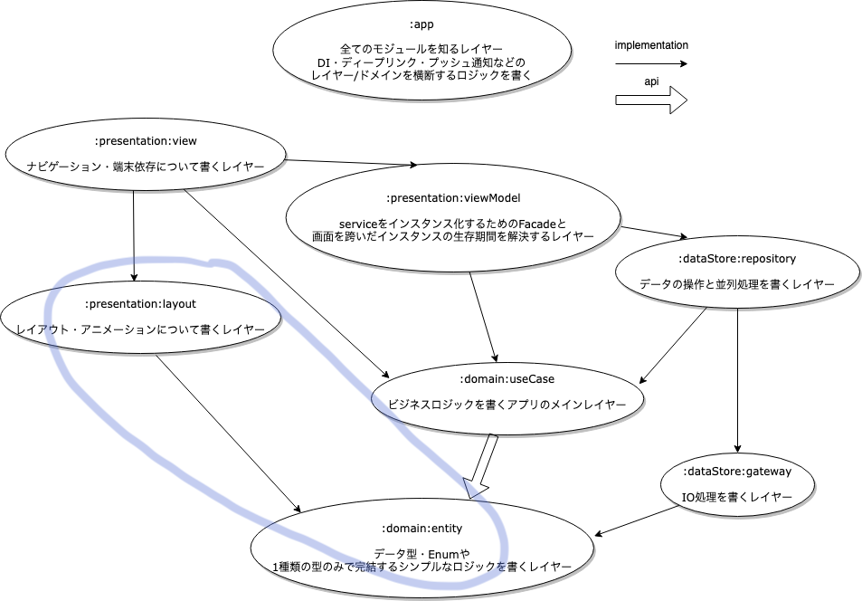

# JetpackComposeEditorTemplate

## アルサーガのアーキテクチャにおいてこのエディタで使う部分

## 使い方
1. 作業するプロジェクト用にgithubのテンプレートレポジトリ機能でコピーレポジトリを作る
2. ローカル上で作業するプロジェクトと同じ階層にコピーレポジトリをクローンする(ディレクトリ構造例を参照)
3. settings.gradleの「projectName」を作業しているプロジェクトのルートディレクトリ名に変換する
4. 「featureName」、「childFeatureName」などをモジュールの入っているディレクトリ名に変換する
5. 「hasChildModule」、「hasChildCoreModule」を現在作業したいドメインの状況に応じて適宜変更する
6. settings.gradleのprojectDirの右辺にあるモジュールのディレクトリパス名を自分のプロジェクトに合わせて変更する
7. gradle syncでエラーが出なければ成功
8. コンパイルの影響範囲が減ったのでキャッシュが死んでしまった場合もPreviewの更新が高速化します。 
9. [実機ビルド] ComposeEditorActivityのsetContentの中で、作業中のプロジェクトのComposeのScreenやWidgetを呼び出す(AndroidStudioの機嫌次第でimportが自動でできない可能性あり)
10. [実機ビルド] Screenなどを呼び出すときはComposeにモックを渡し済みの引数なしのPreview関数をそのまま呼んでしまうのが便利です。

## 注意点
 - このプロジェクトはレイヤー間のtypoなしで最低2つのapp以外のモジュール(layoutとentity)が作成されていることを前提に設計されています
 - このプロジェクトはドメイン毎にモジュールが分かれていることを前提に命名されています。レイヤー毎でのモジュール分割のみのプロジェクトの場合はfeatureNameにレイヤーの名前を入れてください

## ディレクトリ構造例

AndroidStudioProject  
　┣ projectA ← ルートディレクトリ名  
　┣ projectAEditor  
　〜〜〜〜  
　〜〜〜〜  
　┣ projectB  
　┣ projectBEditor  
　〜〜〜〜  
　〜〜〜〜  
　┣ projectC  
　┗ projectCEditor  
